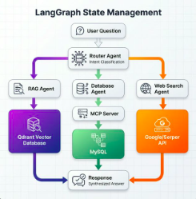

# Agentic RAG System with LangGraph

## 🚀 Features

- **Multi-Agent Architecture**: Sử dụng LangGraph để xây dựng hệ thống multi-agent
- **Intelligent Routing**: Tự động phân loại và định tuyến câu hỏi đến agent phù hợp
- **RAG Agent**: Truy vấn knowledge base từ Qdrant vector database
- **Database Agent**: Quản lý ký túc xá với MySQL thông qua MCP (Model Context Protocol)
- **Web Search Agent**: Tìm kiếm thông tin real-time trên web
- **Modern UI**: Giao diện web hiện đại với chat history và sliding sidebar

## 🏗️ Architecture

```
┌─────────────────────────────────────────────┐
│           User Question                      │
└──────────────────┬──────────────────────────┘
                   ↓
┌─────────────────────────────────────────────┐
│     Router Agent (LLM Classification)        │
│  - Phân tích intent của câu hỏi             │
│  - Route đến agent phù hợp                  │
└──────────┬──────────┬──────────┬────────────┘
           │          │          │
    ┌──────┴───┐  ┌──┴────┐  ┌──┴─────────┐
    │   RAG    │  │  DB   │  │ Web Search │
    │  Agent   │  │ Agent │  │   Agent    │
    └────┬─────┘  └───┬───┘  └─────┬──────┘
         │            │             │
    ┌────┴─────┐ ┌───┴────┐   ┌────┴─────┐
    │ Qdrant   │ │ MySQL  │   │  Serper  │
    │ Vector   │ │  MCP   │   │  Google  │
    │   DB     │ │ Server │   │  Search  │
    └──────────┘ └────────┘   └──────────┘
```

## 📋 Prerequisites

- Python 3.11+
- MySQL Server
- Qdrant Vector Database
- OpenAI API Key
- Serper API Key

## 🔧 Installation

1. **Clone repository và cài đặt dependencies**:
```bash
cd /home/quang/My_Project/DATN_v2/RAG_QrandtDB
pip install -r requirements.txt
```

2. **Cấu hình environment variables**:
```bash
cp .env
# Edit .env với các API keys và database credentials
```

3. **Khởi động Qdrant** (nếu chưa chạy):
```bash
docker run -p 6333:6333 qdrant/qdrant
```

4. **Setup MySQL database**:
```bash
mysql -u root -p < init_database.sql
```

## 🚀 Usage

### Start Backend Server

```bash
uvicorn server:app --reload --host 127.0.0.1 --port 8000
```

### Start Frontend

Mở file `font-end/v2/index.html` trong browser hoặc sử dụng live server.

### API Endpoint

**POST** `/api/generate/search`

Request:
```json
{
  "question": "Có phòng nào còn trống không?"
}
```

Response:
```json
{
  "ok": true,
  "route": "database",
  "answer": "Hiện tại có 5 phòng còn trống..."
}
```

## 🧩 MCP (Model Context Protocol)

Hệ thống sử dụng MCP pattern để chuẩn hóa interface với MySQL:

### MCP Resources
- `mysql://dormitory/rooms` - Database phòng ký túc xá
- `mysql://dormitory/students` - Database sinh viên

### MCP Tools
- `list_available_rooms()` - Liệt kê phòng trống
- `add_student(mssv, ten, nam_sinh, room_id)` - Thêm sinh viên
- `get_student_info(mssv)` - Lấy thông tin sinh viên
- `get_room_info(room_id)` - Lấy thông tin phòng
- `remove_student(mssv)` - Xóa sinh viên

## 🔍 Agent Types

### 1. RAG Agent
- Truy vấn knowledge base từ Qdrant
- Sử dụng OpenAI embeddings (text-embedding-3-small)
- Retrieve top-k relevant documents
- Generate answer với context

### 2. Database Agent
- Kết nối MySQL qua MCP server
- CRUD operations cho dormitory management
- Tool-based execution với LangChain

### 3. Web Search Agent
- Tìm kiếm real-time information
- Sử dụng Google Search qua Serper API
- Synthesize search results với độ chính xác cao

## 📁 Project Structure

```

│── app/
│   ├── core/
│   │   ├── mcp/
│   │   │   └── mysql_mcp_server.py    # MCP Server implementation
│   │   ├── CRUD_Mysql/
│   │   │   └── base_mysql.py          # Legacy MySQL tools
│   │   ├── config/
│   │   │   └── config.py              # Configuration
│   │   └── ...
│   ├── rag/
│   │   └── agentic.py                 # LangGraph agents
│   └── startup/
│       └── startup.py                 # Initialization
├── font-end/
│   └── v2/
│       ├── index.html                 # Modern UI
│       ├── styles.css                 # Styling
│       └── script.js                  # Frontend logic
├── server.py                          # FastAPI server
├── requirements.txt                   # Dependencies
└── .env                               # Environment
```

## 🎯 Example Queries

### RAG Queries
- "Kinh tế công nghiệp là gì?"
- "Giải thích về phát triển bền vững"

### Database Queries
- "Có phòng nào còn trống không?"
- "Thêm sinh viên Nguyễn Văn A, MSSV 2021001, năm sinh 2003 vào phòng A101"
- "Cho tôi biết thông tin sinh viên có MSSV 2021001"
- "Phòng B201 có bao nhiêu sinh viên?"

### Web Search Queries
- "Tin tức mới nhất về AI"
- "Thời tiết hôm nay"
- "Giá Bitcoin hiện tại"

## 🔄 Extending the System

### Add New Agent

1. Define agent function:
```python
def new_agent(state: AgentState) -> AgentState:
    # Your agent logic
    return state
```

2. Add to graph:
```python
workflow.add_node("new_agent", new_agent)
```

3. Update router:
```python
def route_to_agent(state: AgentState):
    if condition:
        return "new_agent"
```

### Add New MCP Tool

1. Add tool to `mysql_mcp_server.py`:
```python
def new_tool(self, param: str) -> Dict[str, Any]:
    # Tool implementation
    pass
```

2. Register in `list_tools()`:
```python
MCPTool(
    name="new_tool",
    description="...",
    inputSchema={...}
)
```

3. Add to `call_tool()` mapping

## 📊 Monitoring

- Backend logs: Check uvicorn console
- Frontend: Browser console (F12)
- Database: MySQL logs

## 🐛 Troubleshooting

### "No response from server"
- Check if backend is running on port 8000
- Verify CORS settings in `server.py`

### "MySQL connection failed"
- Check `.env` MySQL credentials
- Ensure MySQL server is running
- Verify database exists

### "Qdrant connection failed"
- Start Qdrant: `docker run -p 6333:6333 qdrant/qdrant`
- Check QDRANT_URL in `.env`

## 📝 License

MIT License

## 👥 Contributors

- Your Name

## 🙏 Acknowledgments

- LangGraph by LangChain
- OpenAI for embeddings and LLM
- Qdrant for vector database
- Serper for Google Search API
